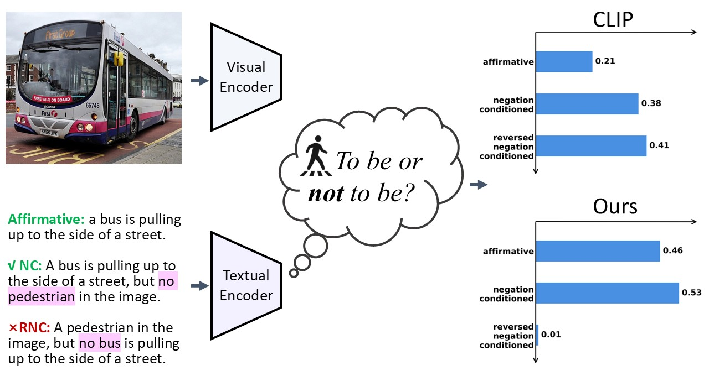

This repository contains the official PyTorch implementation of the paper: Negation-Aware Test-Time Adaptation for Vision-Language Models.

## Overview
<h1 align="center"></h1>

> **Negation-Aware Test-Time Adaptation for Vision-Language Models**<br>
> Haochen Han, Alex Jinpeng Wang, Fangming Liu, Jun Zhu.<br>
> [https://www.arxiv.org/abs/2507.19064](https://www.arxiv.org/abs/2507.19064) 
>
> **Abstract:** *In this paper, we study a practical but less-touched problem in Vision-Language Models (VLMs), \ie, negation understanding. Specifically, many real-world applications require models to explicitly identify what is false or non-existent, \eg, radiologists may search for images that exclude specific conditions. Despite the impressive transferability of VLMs through large-scale training, they suffer from a critical limitation that fails to handle negation. To address this challenge, existing methods attribute its root cause to the scarcity of negation training data and propose to fine-tune VLMs on massive data containing explicit negation. Undoubtedly, such data-centric solutions demand substantial data and computational resources, limiting their sustainable widespread adoption. To tackle negation in a low-carbon manner, we empirically observe that the key obstacle lies in the dual-concept shifts between the affirmation and negation distributions. Therefore, we propose a Negation-Aware Test-Time Adaptation (NEAT) method to efficiently adjust distribution-related parameters during inference. In brief, NEAT can reduce distribution shift in consistent semantics while eliminating false distributional consistency in unrelated semantics. Extensive experiments on the various negation understanding tasks verify the effectiveness of the proposed method. Remarkably, with less than 0.01\% of trainable parameters, NEAT achieves comparable or superior performance to state-of-the-art post-training approaches.*

## Dataset Preparation
We use the recent advance NegBench to evaluate models' negation understanding capabilities, which covers images, videos, and medical images. The `raw_data/`  format is as follows:
```
raw_data/
├── images/
│   ├── voc2007 (raw images)
│   ├── val2017 (raw images)
│   ├── COCO_val_negated_retrieval_llama3.1_rephrased_affneg_true_logic_inversion.csv
│   ├── COCO_val_retrieval.csv
│   ├── COCO_val_mcq_llama3.1_rephrased.csv
│   └── VOC2007_mcq_llama3.1_rephrased.csv
├── videos/
│   ├── TestVideo (raw video)
│   ├── msr_vtt_retrieval_rephrased_llama_logic_inversion.csv
|   ├── msr_vtt_retrieval.csv
│   └── msr_vtt_mcq_rephrased_llama.csv
├── chexpert/
│   ├── valid (raw medical images)
│   ├── Atelectasis
│       ├── chexpert_affirmation_binary_mcq.csv
│       └── chexpert_negation_binary_mcq.csv
│   ├── Cardiomegaly
│       ├── chexpert_affirmation_binary_mcq.csv
│       └── chexpert_negation_binary_mcq.csv
│   ├── Consolidation
│       ├── chexpert_affirmation_binary_mcq.csv
│       └── chexpert_negation_binary_mcq.csv
│   ├── Lung_Opacity
│       ├── chexpert_affirmation_binary_mcq.csv
│       └── chexpert_negation_binary_mcq.csv
```
For experimental convenience, we directly provide the LLM-processed captions in `xxx_logic_inversion.csv`. All CSV files and corresponding raw images or videos are available for download:
[raw_data](https://drive.google.com/file/d/1u8BqLc8LOGLSketxyx0KT3ug6lf1A3tK/view?usp=drive_link)

## Supported Models
Our method can be easily applied to almost all VLMs. We provide examples with CLIP-based models (e.g., OpenAI CLIP, ConCLIP, NegCLIP, PLIP) and BLIP-based models.

## Training and Evaluation
Remember to replace the 'csv' paths. If you want to use other VLMs, replace the '--model' with your model weights.
For example, you can adapt OpenAI-CLIP on COCO Negated Retrieval data as follows:
```
python -m src.main_TTA.py
--name
NEAT_clip_coco
--model
ViT-B-32
--pretrained
openai
--csv-caption-key
caption
--csv-img-key
filepath
--coco-mcq=/mnt/hhc_data/NegBench/images/COCO_val_mcq_llama3.1_rephrased.csv
--coco-negated-retrieval=/mnt/hhc_data/NegBench/images/COCO_val_negated_retrieval_llama3.1_rephrased_affneg_true.csv
--coco-negated-tta=/mnt/hhc_data/NegBench/images/COCO_val_negated_retrieval_llama3.1_rephrased_affneg_true_logic_inversion.csv
--coco-retrieval=/mnt/hhc_data/NegBench/images/COCO_val_retrieval.csv
--msrvtt-negated-retrieval=/mnt/hhc_data/NegBench/videos/msr_vtt_retrieval_rephrased_llama_logic_inversion.csv
--msrvtt-mcq=/mnt/hhc_data/NegBench/videos/msr_vtt_mcq_rephrased_llama.csv
--tta-init-lr
2e-4
--tta-steps
3
--tta-retrieval
t2i
--tta-temperature
0.03
--tta-temperature2
0.07
--tta-total-bs
256
--tta-wd
0.001
```

## Checkpoints by NEAT
You can find the NEATed checkpoints here (coming soon). And we also provide pre-trained checkpoints for convenience.

## Acknowledgements
Some portions of the code in this repository are adaptations from the following repositories: [negbench](https://github.com/m1k2zoo/negbench) and [TCR](https://github.com/XLearning-SCU/2025-ICLR-TCR).
